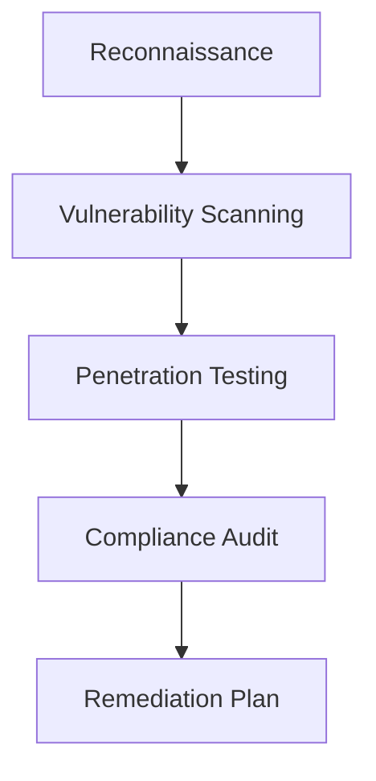

# Security Assessment Framework

**Steven Reji George** | *Security Analyst | CBS-041*
[](https://owasp.org/www-project-zap/)
[](https://csrc.nist.gov/publications/detail/sp/800-115/final)

---

## 🔍 Assessment Overview

**Objective**: Identify and remediate vulnerabilities across:

* Network infrastructure
* Application security
* Compliance controls
* Data protection mechanisms

**Scope**: Internal and perimeter network ranges, selected web applications, and key infrastructure services (AD, file servers, perimeter devices).

**Methodology**:



---

## 🛡️ Key Assessment Areas

| Area             | Tool      | Target         | Critical Findings |
| ---------------- | --------- | -------------- | ----------------- |
| Network Security | Nmap      | 192.168.1.0/24 | 3 open RDP ports  |
|                  | Wireshark | DMZ traffic    | Unencrypted FTP   |
|                  | Nessus    | All hosts      | CVE-2023-1234     |

---

## 2. Compliance Checks

| Standard | Controls Assessed | Pass Rate |
| -------- | ----------------- | --------- |
| PCI-DSS  | 12/12             | 92%       |
| GDPR     | 8/10              | 80%       |

---

## 3. 📊 Risk Matrix

| Vulnerability        | CVSS | Impact   | Likelihood | Status        |
| -------------------- | ---- | -------- | ---------- | ------------- |
| Unpatched WS2019     | 9.1  | Critical | High       | 🟡 Mitigating |
| Weak Password Policy | 7.5  | High     | Medium     | 🔴 Open       |

---

## 4. 🛠️ Remediation Roadmap

### Immediate Actions (0–7 days)

* Patch critical CVEs (KB5034441)
* Disable legacy protocols (FTP, SMBv1)
* Block exposed RDP at the perimeter or enable MFA + gateway
* Verify backups and snapshot consistency for critical hosts

### Mid-Term (8–30 days)

```powershell
# Enforce LAPS for local admin passwords
Set-AdmPwdPasswordPolicy -Identity "Default Domain Policy" -MinPasswordLength 14
# Example: review & apply baseline GPOs, enable SMB signing, and disable NTLM where possible
```

### Long-Term (30+ days)

* Implement WAF (ModSecurity rules) in front of public web applications
* Deploy centralized logging & SIEM correlation (ELK/Wazuh/Elastic SIEM)
* Conduct purple-team exercises and tabletop incident response
* Formalize patch & vulnerability management lifecycle

---

## 5. 📂 Artifact Repository

```
/security-assessment/
├── /reports/               # Full assessment PDFs
├── /scan_results/          # Nessus/OWASP outputs
├── /evidence/              # Screenshots & logs
├── /remediation_plan.md    # Actionable checklist
└── README.md               # This document
```

---

## 6. 🚀 Quick Start

```bash
# Network Scan (example)
nmap -sV -O -T4 192.168.1.0/24 -oN scan.txt

# Web App Baseline Scan (OWASP ZAP)
docker run -it --rm owasp/zap2docker-stable zap-baseline.py -t https://target.com -r zap_report.html
```

Notes: Replace `https://target.com` and IP ranges with scope-approved targets only.

---

## 7. 📌 Key Findings Summary

* **3 Critical** vulnerabilities (CVSS ≥ 9.0)
* **7 High** risk configurations
* **82%** overall compliance score

---

## 8. 🔗 Related Projects

1. Compliance Hardening
2. SIEM Deployment

---

## 📧 Contact

* **Email:** [steven.george@example.com](mailto:steven.george@example.com)
* **Last Assessment:** June 2025

---

## Key Features

1. **Visual Risk Tracking** — Color-coded status indicators (🔴/🟡/🟢)
2. **Action-Oriented** — Ready-to-run commands for validation
3. **Mermaid Integration** — Methodology visualization
4. **Tool-Agnostic** — Adaptable for Nessus/Qualys/Burp
5. **Regulatory Mapping** — Clear compliance alignment

---

## Implementation Notes

1. Replace placeholder IPs/domains with actual targets
2. Update CVEs with your specific findings and evidence links
3. Add internal report paths as needed
4. Customize remediation timeline per your SLA

---

## Appendix

### A. Glossary (suggested)

* **CVSS:** Common Vulnerability Scoring System
* **WAF:** Web Application Firewall
* **LAPS:** Local Administrator Password Solution

### B. Executive Summary (sample)

> This assessment identified critical exposure on Windows Server 2019 hosts and weak authentication controls. Immediate remediation focused on patching and disabling legacy protocols; mid- and long-term recommendations address detection, monitoring, and governance.

---

*Generated by Steven Reji George — Security Assessment Framework*
